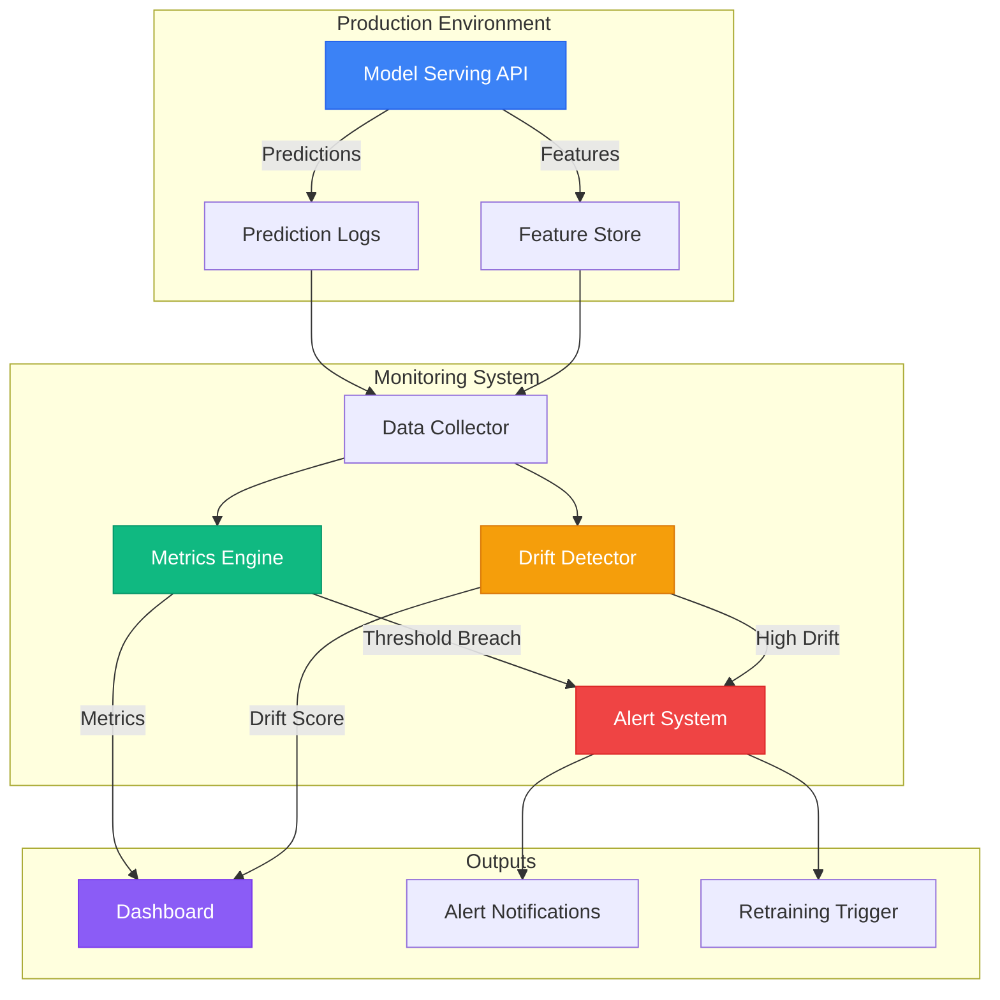
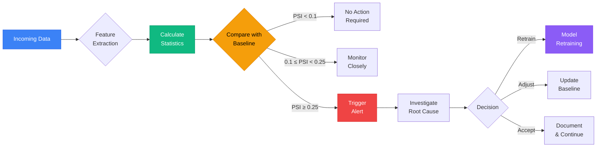
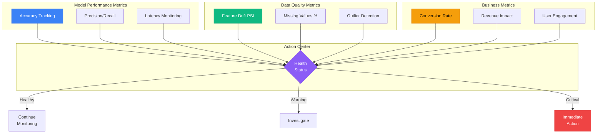

# Real-time Model Monitoring in Production: A Practical Guide

## Business Context and Problem Statement

In today's data-driven business landscape, deploying machine learning models to production is just the beginning. E-commerce platforms, financial institutions, and retail chains invest heavily in developing sophisticated predictive models, yet many fail to capture the degradation that occurs post-deployment. Without *real-time model monitoring*, organizations risk making decisions based on stale or inaccurate predictions, leading to revenue loss, customer dissatisfaction, and operational inefficiencies.

Consider an online retail company that uses a recommendation engine to personalize product suggestions. Initially, the model performs well with 85% click-through rate (CTR) accuracy. However, as seasonal trends shift or new products enter the market, the model's performance begins to deteriorate. Without real-time monitoring, this decline may go unnoticed for weeks, resulting in:

- Reduced customer engagement and sales
- Increased customer churn due to irrelevant recommendations
- Wasted marketing spend on ineffective campaigns

This degradation often occurs gradually—what's known as *model drift*—making it nearly impossible to detect without proactive monitoring systems in place. The challenge lies in building a robust infrastructure that can track model performance in real-time, detect anomalies, and trigger alerts or automated retraining protocols.




*Real-time model performance metrics and drift detection patterns*

## Understanding Real-time Model Monitoring

### Key Requirements for Effective Monitoring

Real-time model monitoring requires a comprehensive approach that addresses multiple dimensions of model health:

- **Performance tracking**: Continuous evaluation of prediction accuracy against ground truth data
- **Data drift detection**: Identification of changes in input feature distributions
- **Concept drift monitoring**: Detection of shifts in the underlying relationship between features and target variables
- **Prediction distribution analysis**: Monitoring the statistical properties of model outputs
- **Latency and throughput monitoring**: Ensuring models meet operational SLAs

### Mathematical Foundations

Model performance degradation can be quantified using various statistical measures. For classification problems, the *Population Stability Index (PSI)* is commonly used to detect feature drift:

$$PSI = \sum_{i=1}^{n} (Actual_i - Expected_i) \times \ln\left(\frac{Actual_i}{Expected_i}\right)$$

Where *Actual_i* and *Expected_i* represent the actual and expected proportions of observations in bin *i*. PSI values above 0.25 typically indicate significant distribution shifts requiring investigation.

For regression models, *Mean Absolute Percentage Error (MAPE)* provides a normalized measure of prediction accuracy:

$$MAPE = \frac{100\%}{n} \sum_{t=1}^{n} \left|\frac{A_t - F_t}{A_t}\right|$$

Where *A_t* represents actual values and *F_t* represents forecasted values.

## Implementation Methodology

### Real-time Monitoring Framework

Building an effective monitoring system requires a structured approach that integrates with existing MLOps pipelines. The framework consists of four key components:

1. **Data Collection Layer**: Captures model inputs, outputs, and actual outcomes in real-time
2. **Processing Engine**: Computes performance metrics and drift indicators at regular intervals
3. **Alerting System**: Triggers notifications based on predefined thresholds and business rules
4. **Visualization Dashboard**: Provides stakeholders with actionable insights through intuitive interfaces

### Practical Example: E-commerce Recommendation System

Let's examine a concrete implementation for an e-commerce recommendation engine. The model predicts customer purchase probability based on browsing behavior, demographic data, and historical transactions.

**Table 1: Key Performance Indicators for Recommendation Model**

| Metric | Description | Threshold | Monitoring Frequency |
|--------|-------------|-----------|---------------------|
| CTR Accuracy | Click-through rate prediction accuracy | >80% | Every hour |
| Conversion Rate | Actual purchase conversion from recommendations | >12% | Daily |
| Feature Drift (PSI) | Stability index for user behavior features | <0.1 | Every 6 hours |
| Response Time | Model inference latency | <200ms | Every 5 minutes |

### Code Implementation

The monitoring system requires integration with the production environment to capture prediction data:

```python
import pandas as pd
from sklearn.metrics import accuracy_score
import numpy as np

class ModelMonitor:
    def __init__(self, model_name, baseline_data):
        self.model_name = model_name
        self.baseline_data = baseline_data
        self.predictions_log = []
        
    def log_prediction(self, features, prediction, actual=None):
        """Log model predictions and actual outcomes"""
        log_entry = {
            'timestamp': pd.Timestamp.now(),
            'features': features,
            'prediction': prediction,
            'actual': actual
        }
        self.predictions_log.append(log_entry)
        
    def calculate_psi(self, current_data, baseline_data, bins=10):
        """Calculate Population Stability Index"""
        # Create bins for both datasets
        breakpoints = np.linspace(0, 1, bins + 1)
        current_binned = pd.cut(current_data, breakpoints, include_lowest=True)
        baseline_binned = pd.cut(baseline_data, breakpoints, include_lowest=True)
        
        # Calculate proportions
        current_prop = current_binned.value_counts(normalize=True)
        baseline_prop = baseline_binned.value_counts(normalize=True)
        
        # Align indices and calculate PSI
        merged = pd.DataFrame({'current': current_prop, 'baseline': baseline_prop})
        merged = merged.fillna(0)
        
        psi = sum((merged['current'] - merged['baseline']) * 
                  np.log(merged['current'] / (merged['baseline'] + 1e-10)))
        return psi
```




*End-to-end monitoring pipeline architecture*

## Model Evaluation and Performance Assessment

### Comprehensive Monitoring Dashboard

Effective model monitoring requires continuous evaluation across multiple dimensions. Retail and e-commerce companies typically monitor these key metrics:

**Table 2: Drift Detection Thresholds by Business Domain**

| Business Domain | Drift Type | Metric | Threshold | Business Impact |
|----------------|------------|--------|-----------|-----------------|
| E-commerce | Feature Drift | PSI | >0.1 | Reduced personalization effectiveness |
| Financial Services | Concept Drift | Accuracy Drop | >15% | Increased fraud risk |
| Healthcare | Performance Decay | Recall Drop | >10% | Missed diagnosis risk |
| Manufacturing | Data Quality | Missing Values | >5% | Production quality issues |

### Statistical Approaches for Drift Detection

Advanced monitoring systems employ multiple statistical techniques to detect different types of drift:

- **Kolmogorov-Smirnov Test**: Non-parametric test for comparing two samples
- **Chi-square Test**: For categorical feature distribution comparison
- **CUSUM Control Charts**: Sequential analysis technique for detecting small shifts
- **EWMA Charts**: Exponentially weighted moving average for smooth trend detection

### Real-world Case Study: Financial Risk Assessment

A major bank implemented real-time monitoring for their credit risk assessment model, which processes over 10,000 loan applications daily. The monitoring system detected a gradual increase in feature drift (PSI = 0.18) over a two-week period, indicating changes in applicant behavior patterns. This early warning allowed the data science team to investigate and identify that new marketing campaigns were attracting a different customer demographic than previously modeled.

**Table 3: Performance Metrics Before and After Drift Detection**

| Metric | Pre-drift | Post-drift | Improvement After Retraining |
|--------|-----------|------------|------------------------------|
| Approval Accuracy | 87.3% | 79.8% | 89.1% |
| Default Rate | 2.1% | 3.4% | 1.8% |
| Processing Time | 156ms | 189ms | 142ms |
| Model Confidence | 0.76 | 0.62 | 0.81 |

## Practical Implementation Challenges

### Technical Infrastructure Requirements

Implementing real-time model monitoring at scale presents several technical challenges that organizations must address:

- **Data Pipeline Complexity**: Integrating monitoring with existing data infrastructure while maintaining low latency
- **Storage and Compute**: Managing large volumes of prediction logs and metric calculations efficiently
- **Scalability**: Ensuring the monitoring system can handle increasing model deployments and prediction volumes
- **Real-time Processing**: Balancing comprehensive monitoring with operational performance requirements

### Common Implementation Pitfalls

Organizations often encounter several common mistakes during monitoring implementation:

- **Over-monitoring**: Tracking too many metrics leads to alert fatigue and operational overhead
- **Inadequate Baselines**: Failing to establish proper historical baselines for meaningful comparison
- **Delayed Detection**: Monitoring intervals that are too infrequent to catch critical performance drops
- **Poor Alert Configuration**: Generic alerts that don't account for business context or seasonality

### Solutions and Best Practices

Industry best practices have emerged to address these challenges effectively:

****

****

## Advanced Monitoring Techniques

### Automated Model Retraining Triggers

Modern monitoring systems incorporate automated decision-making capabilities that trigger model retraining based on predefined criteria:

```python
def should_retrain(model_monitor, performance_threshold=0.15, drift_threshold=0.2):
    """Determine if model retraining is needed"""
    
    # Check performance degradation
    recent_performance = model_monitor.get_recent_performance()
    baseline_performance = model_monitor.get_baseline_performance()
    
    performance_drop = (baseline_performance - recent_performance) / baseline_performance
    
    # Check drift indicators
    recent_drift = model_monitor.calculate_recent_drift()
    
    # Trigger retraining if either condition is met
    if performance_drop > performance_threshold or recent_drift > drift_threshold:
        return True, {
            'performance_drop': performance_drop,
            'drift_level': recent_drift
        }
    
    return False, None
```

### Ensemble Monitoring Approaches

Advanced organizations employ ensemble monitoring strategies that combine multiple detection methods:

- **Statistical Tests**: Traditional hypothesis testing for distribution comparison
- **Machine Learning Detectors**: Anomaly detection models trained on historical monitoring data
- **Rule-based Systems**: Business logic-based alerts for domain-specific scenarios
- **Expert Systems**: Integration with domain expert knowledge for contextual interpretation




*Trend analysis showing drift detection and performance correlation*

## Conclusion and Actionable Insights

Real-time model monitoring is not just a technical necessity—it's a strategic imperative for organizations that rely on machine learning for competitive advantage. The implementation requires careful consideration of business context, technical constraints, and operational requirements.

Key takeaways for successful implementation include:

- **Start with Business Impact**: Focus monitoring efforts on models with the highest business value and risk exposure
- **Establish Clear Thresholds**: Define performance and drift thresholds based on historical data and business requirements
- **Integrate with MLOps**: Ensure monitoring is part of the complete model lifecycle management process
- **Balance Automation with Human Oversight**: Use automated alerts for quick detection while maintaining human judgment for complex decisions

Organizations that invest in robust real-time monitoring systems see measurable improvements in model performance, reduced operational risk, and increased confidence in AI-driven decision making. The key is to start small, learn continuously, and scale systematically based on proven results.

As the field of MLOps continues to evolve, real-time model monitoring will become increasingly sophisticated, incorporating advanced techniques like automated feature engineering, dynamic threshold adjustment, and predictive maintenance. Companies that embrace these practices today will be well-positioned to leverage the full potential of machine learning in tomorrow's competitive landscape.