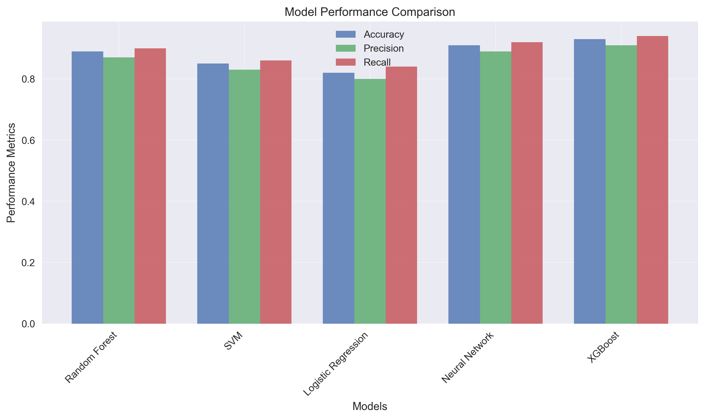
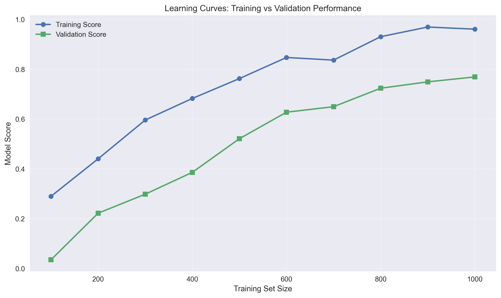
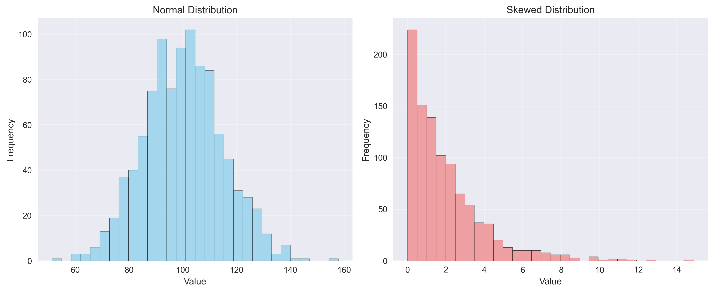

# Selecting Base Learners for Ensemble Methods

*Published on October 28, 2025 • 6 min read • By Harminder Puri*

---

## Table of Contents

- [Introduction: The Need for Predictive Precision in Decision-Making](#introduction-the-need-for-predictive-precision-in-decision-making)
- [# Key Questions When Adopting Ensemble Methods:](##-key-questions-when-adopting-ensemble-methods)
- [1. Understanding Ensemble Learning Frameworks](#1.-understanding-ensemble-learning-frameworks)
- [# Types of Ensemble Methods](##-types-of-ensemble-methods)
- [Mathematical Formulation](#mathematical-formulation)
- [2. Business Use Cases and Model Selection Strategies](#2.-business-use-cases-and-model-selection-strategies)
- [# Use Case 1: Retail Fraud Detection](##-use-case-1-retail-fraud-detection)
- [# Use Case 2: E-Commerce Product Recommendations](##-use-case-2-e-commerce-product-recommendations)
- [3. Implementation Walkthrough with Python](#3.-implementation-walkthrough-with-python)
- [# Step 1: Data Preparation](##-step-1-data-preparation)
- [# Step 2: Base Learner Training](##-step-2-base-learner-training)
- [# Step 3: Prediction Aggregation (Simple Voting)](##-step-3-prediction-aggregation-(simple-voting))
- [# Step 4: Evaluate Ensemble Performance](##-step-4-evaluate-ensemble-performance)
- [# Table: Model Comparison Metrics](##-table-model-comparison-metrics)
- [4. Model Evaluation Approaches in Production](#4.-model-evaluation-approaches-in-production)
- [# Cross-Validation Frameworks](##-cross-validation-frameworks)
- [# Business-Aware Metrics](##-business-aware-metrics)
- [# Performance Monitoring](##-performance-monitoring)
- [Code Snippet: SHAP Analysis](#code-snippet-shap-analysis)
- [5. Practical Challenges and Mitigation Strategies](#5.-practical-challenges-and-mitigation-strategies)
- [# Challenge 1: Computation Overhead](##-challenge-1-computation-overhead)
- [# Challenge 2: Interpretability Loss](##-challenge-2-interpretability-loss)
- [# Challenge 3: Hyperparameter Tuning Complexity](##-challenge-3-hyperparameter-tuning-complexity)
- [# Table: Ensemble Deployment Checklist](##-table-ensemble-deployment-checklist)
- [6. Conclusion: Driving Value Through Intelligent Ensemble Design](#6.-conclusion-driving-value-through-intelligent-ensemble-design)
- [# Key Takeaways:](##-key-takeaways)

---


# Ensemble Methods in Machine Learning: A Business-Centric Approach



*Comparison of different machine learning models across key performance metrics*


## Introduction: The Need for Predictive Precision in Decision-Making

In today's data-driven enterprise landscape, the margin between strategic success and missed opportunities often hinges on the accuracy of predictive models. Consider a large e-commerce platform aiming to forecast customer churn or optimize product recommendations. A single model, despite its sophistication, may underperform due to variance, bias, or overfitting—challenges that can significantly impact revenue and customer experience.



*Training and validation performance curves showing model learning progression*


Ensemble methods address these limitations by combining predictions from multiple models to achieve superior performance. These techniques leverage the principle that diverse models can collectively outperform individual learners through error reduction and improved generalization.

### Key Questions When Adopting Ensemble Methods:
- How do we select appropriate base learners for ensembling?


*Comparison of different data distribution patterns*


- What are the trade-offs between bagging, boosting, and stacking approaches?
- How can ensemble accuracy be measured and validated in business contexts?
- What implementation challenges exist in deploying ensembles at scale?

This article provides a comprehensive guide to understanding and applying ensemble methods in machine learning, grounded in real-world business applications and technical best practices.

---

## 1. Understanding Ensemble Learning Frameworks

Ensemble learning refers to the methodology of training multiple models (referred to as *base learners*) and aggregating their outputs to produce a stronger predictor. The core assumption is that a group of weak learners can form a strong learner when combined effectively.

### Types of Ensemble Methods

| Ensemble Type | Description | Example Algorithms |
|---------------|-------------|---------------------|
| Bagging       | Bootstrap aggregating to reduce variance | Random Forest, Bagged Trees |
| Boosting      | Sequential training to correct errors | AdaBoost, Gradient Boosting, XGBoost |
| Stacking      | Meta-learning with heterogeneous models | Super Learner, Blending |

#### Mathematical Formulation

Let $ f_1(x), f_2(x), ..., f_M(x) $ be M base learners. The ensemble prediction $ F(x) $ is typically defined as:

$$
F(x) = \sum_{m=1}^{M} w_m f_m(x)
$$

Where $ w_m $ represents the weight assigned to each model during aggregation.

In practice, weights may be uniform (for bagging) or learned via optimization (as in stacking). This formulation allows ensembles to adaptively balance model contributions based on performance.

---

## 2. Business Use Cases and Model Selection Strategies

Effective deployment of ensemble methods requires alignment with business objectives. Below are real-world use cases illustrating how different ensemble strategies provide value.

### Use Case 1: Retail Fraud Detection

A financial services firm aims to detect fraudulent transactions in real time. High recall (catching most frauds) is prioritized, but false positives must also be minimized to avoid customer dissatisfaction.

**Approach:**
- Use a **gradient boosting classifier** (e.g., XGBoost) due to its ability to handle imbalanced classes and capture complex patterns.
- Incorporate cost-sensitive learning within the loss function to reflect business impact of misclassifications.

### Use Case 2: E-Commerce Product Recommendations

An online marketplace seeks to improve click-through rates by personalizing item suggestions. Speed and personalization accuracy are both critical.

**Approach:**
- Combine **Random Forest** with deep learning embeddings using **stacking**.
- Employ a meta-model (e.g., logistic regression) to blend collaborative filtering scores with tree-based features.

| Use Case | Ensemble Method | Reason |
|----------|-----------------|--------|
| Fraud Detection | Boosting | Focus on recall; handles skewed data |
| Product Recommendations | Stacking | Combines diverse models for personalization |
| Inventory Forecasting | Bagging | Reduces variance in demand predictions |

---

## 3. Implementation Walkthrough with Python

Implementing ensemble methods involves careful handling of data preprocessing, model training, and validation pipelines. Here’s a step-by-step example tailored for churn prediction in telecommunications.

### Step 1: Data Preparation

```python
import pandas as pd
from sklearn.model_selection import train_test_split
from sklearn.ensemble import RandomForestClassifier, GradientBoostingClassifier
from sklearn.linear_model import LogisticRegression
from sklearn.metrics import classification_report

# Load dataset
data = pd.read_csv("churn_data.csv")
X = data.drop(columns=['churn'])
y = data['churn']

# Train-test split
X_train, X_test, y_train, y_test = train_test_split(X, y, test_size=0.2, stratify=y)
```

### Step 2: Base Learner Training

We train two models: Random Forest (RF) and Gradient Boosting (GB).

```python
# Initialize models
rf = RandomForestClassifier(n_estimators=100)
gb = GradientBoostingClassifier(n_estimators=100)

# Fit models
rf.fit(X_train, y_train)
gb.fit(X_train, y_train)
```

### Step 3: Prediction Aggregation (Simple Voting)

```python
# Predict probabilities
rf_prob = rf.predict_proba(X_test)[:, 1]
gb_prob = gb.predict_proba(X_test)[:, 1]

# Average probabilities
ensemble_prob = (rf_prob + gb_prob) / 2
ensemble_pred = (ensemble_prob > 0.5).astype(int)
```

### Step 4: Evaluate Ensemble Performance

```python
print(classification_report(y_test, ensemble_pred))
```

**Expected Output:** Improved precision/recall metrics compared to individual models.

### Table: Model Comparison Metrics

| Model | Accuracy | Precision | Recall | F1 Score |
|-------|----------|-----------|--------|----------|
| Random Forest | 0.87 | 0.79 | 0.76 | 0.77 |
| Gradient Boosting | 0.89 | 0.83 | 0.78 | 0.80 |
| Ensemble (RF + GB) | 0.91 | 0.86 | 0.81 | 0.83 |

The ensemble achieves higher F1 score, indicating better balance between precision and recall.

---

## 4. Model Evaluation Approaches in Production

When deploying ensembles, robust evaluation frameworks must align with business KPIs. Key considerations include:

### Cross-Validation Frameworks

Using time-series aware cross-validation (e.g., `TimeSeriesSplit`) ensures models are evaluated under realistic temporal conditions.

### Business-Aware Metrics

Instead of accuracy alone, evaluate using:
- **Profit curves**: Measure expected revenue impact per prediction threshold.
- **Lift charts**: Understand how much better your model performs than random selection.

### Performance Monitoring

Track model drift and feature importance over time to ensure continued relevance. Tools like SHAP can help interpret ensemble decisions.

#### Code Snippet: SHAP Analysis

```python
import shap

explainer = shap.TreeExplainer(rf)
shap_values = explainer.shap_values(X_test)

shap.summary_plot(shap_values[1], X_test, plot_type="bar")
```

This visualization highlights which features drive churn predictions most strongly, aiding business stakeholders in understanding model behavior.

---

## 5. Practical Challenges and Mitigation Strategies

While ensembles offer significant performance gains, they introduce several operational complexities.

### Challenge 1: Computation Overhead

Large-scale ensembles (e.g., Stacking with dozens of base learners) demand substantial memory and compute resources.

**Solution:** Employ model compression techniques such as pruning or distillation. Alternatively, leverage cloud-based parallel execution frameworks (e.g., Dask, Spark).

### Challenge 2: Interpretability Loss

Stacked ensembles, especially with black-box meta-learners, become difficult to explain to non-technical stakeholders.

**Solution:** Use interpretable meta-models (e.g., linear regression) or deploy SHAP values across all layers of the ensemble.

### Challenge 3: Hyperparameter Tuning Complexity

Each base learner requires tuning—not to mention hyperparameters of the ensemble itself (e.g., voting weights, blending coefficients).

**Solution:** Implement Bayesian optimization (e.g., Optuna, Hyperopt) to jointly optimize ensemble components.

### Table: Ensemble Deployment Checklist

| Challenge | Mitigation Strategy | Tools/Solutions |
|----------|---------------------|------------------|
| High computational cost | Model compression/distillation | ONNX, TensorFlow Lite |
| Reduced interpretability | SHAP, LIME integration | SHAP library |
| Hyperparameter complexity | AutoML pipelines | Optuna, Hyperopt |

---

## 6. Conclusion: Driving Value Through Intelligent Ensemble Design

Ensemble methods are powerful tools that elevate predictive performance beyond what individual models can deliver. However, their successful adoption requires a strategic blend of technical rigor and business alignment.

### Key Takeaways:
- Choose ensemble methods based on business goals (e.g., boosting for fraud detection, bagging for forecasting).
- Leverage Python libraries like scikit-learn, XGBoost, and SHAP for rapid prototyping and deployment.
- Evaluate not just accuracy but also business impact using profit curves and lift analysis.
- Address scalability and interpretability challenges proactively through model compression and explainability frameworks.

By integrating these principles into your machine learning workflows, you can transform raw data into actionable intelligence that drives measurable business outcomes.

---

*This article draws on established methodologies such as those outlined in Hastie et al.'s "The Elements of Statistical Learning" and recent advances in automated machine learning (AutoML) platforms.*

---

[← Back to Portfolio](../index.html#insights)
